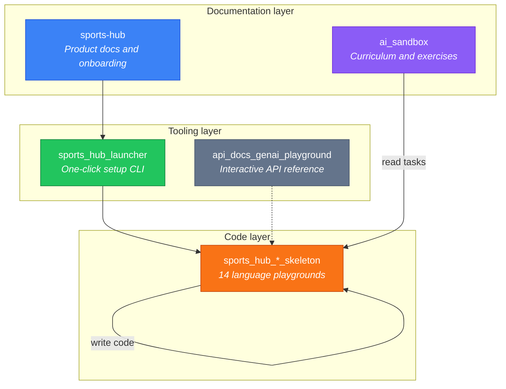
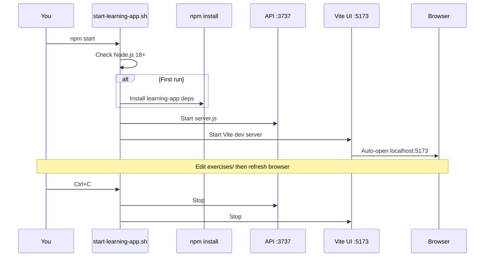

<div align="center">

# AI Sandbox

**The curriculum skeleton for Gen AI engineering practice**

Exercises, hints, quizzes, reference solutions, and the PayFlow legend

<br/>

[](LICENSE)
[](https://nodejs.org)
[](exercises/)
[](https://github.com/dark-side/sports-hub)

<br/>

[**Launch portal**](#one-command-start) | [**Pick a playground**](#playgrounds) | [**Curriculum**](#curriculum) | [**Sports Hub**](https://github.com/dark-side/sports-hub)

</div>

---

## Table of contents

- [What is this repo?](#what-is-this-repo)
- [Ecosystem map](#ecosystem-map)
- [One-command start](#one-command-start)
- [Playgrounds](#playgrounds)
- [Curriculum](#curriculum)
- [Repository map](#repository-map)
- [Quick start checklist](#quick-start-checklist)

---

## What is this repo?

<table>
<tr>
<td width="50%" valign="top">

### This repo (`ai_sandbox`)

The **textbook and answer key**

- Exercise briefs and acceptance criteria
- Progressive hints and quizzes
- Reference solutions
- ADRs, threat models, eval specs

</td>
<td width="50%" valign="top">

### A playground ([Sports Hub](https://github.com/dark-side/sports-hub))

The **lab where you build**

- Runnable apps and services
- Your branches, PRs, and CI
- Hands-on experimentation
- Language-specific tooling

</td>
</tr>
</table>

> **`ai_sandbox` is not where you build.**  
> It is the **source-of-truth skeleton** for the PayFlow Gen AI Advanced Learning curriculum.  
> Clone a [Sports Hub skeleton](https://github.com/dark-side/sports-hub), practice there, and use this repo as your curriculum guide.

---

## Ecosystem map



| Step | Repository | Role |
|:--:|---|---|
| 1 | [sports-hub](https://github.com/dark-side/sports-hub) | Product legend, requirements, feature docs |
| 2 | [sports_hub_launcher](https://github.com/dark-side/sports_hub_launcher) | Auto-clone, build and run any skeleton |
| 3 | `sports_hub_*_skeleton` | Your working codebase |
| 4 | **ai_sandbox** (you are here) | Tasks, hints, quizzes, solutions |

---

## The PayFlow legend

> **PayFlow** is a fintech payment-processing startup running a **Ticket-to-PR harness** on microservices for payment validation, fraud detection, and billing reconciliation.
>
> The harness works, but it has no spec layer, no eval suite, no cost controls, no guardrails, and no observability. Token costs are 40% over budget. A PR broke fraud detection last week.
>
> Across **12 sections and a capstone**, you harden that workflow one discipline at a time.

---

## One-command start

The **interactive learning portal** is the fastest way in: a local web app with tasks, hints, quizzes, and solutions. One command starts everything and opens the browser.



### Prerequisites

| Requirement | How to check |
|---|---|
| **Node.js 18+** | `node --version` |
| **npm** (bundled with Node) | `npm --version` |
| **Git** | `git --version` |

```bash
# macOS
brew install node
```

> Per-OS setup (Ubuntu, Windows WSL, native Windows PowerShell) is in
> [Setup by operating system](#setup-by-operating-system) below.

### Launch in 2 steps

```bash
# 1. Clone
git clone https://github.com/dark-side/ai_sandbox.git
cd ai_sandbox

# 2. Start
npm start
```

<details>
<summary><strong>Alternative:</strong> run the shell script directly</summary>

```bash
chmod +x start-learning-app.sh   # first time only
./start-learning-app.sh
```

</details>

### Setup by operating system

`npm start` runs a bash launcher (`start-learning-app.sh`) that starts both servers and
opens the browser. It works natively on **macOS**, **Linux**, and **Windows via WSL or Git
Bash**. On **native Windows (PowerShell)** there is no bash, so use the two-command path below.

<details>
<summary><strong>macOS</strong></summary>

```bash
brew install node          # Node.js 18+ (skip if already installed)
git clone https://github.com/dark-side/ai_sandbox.git
cd ai_sandbox
npm start
```

</details>

<details>
<summary><strong>Ubuntu / Debian Linux</strong></summary>

```bash
# Node.js 18+ from NodeSource (Ubuntu's apt node can be too old)
curl -fsSL https://deb.nodesource.com/setup_20.x | sudo -E bash -
sudo apt-get install -y nodejs git

git clone https://github.com/dark-side/ai_sandbox.git
cd ai_sandbox
npm start
```

If `./start-learning-app.sh` reports `Permission denied`, run `chmod +x start-learning-app.sh` once.

</details>

<details>
<summary><strong>Windows 10/11 — WSL (recommended)</strong></summary>

WSL gives you a real Linux shell, so the one-command launcher works unchanged.

```powershell
# In PowerShell (admin), install WSL once, then reopen the Ubuntu terminal
wsl --install
```

```bash
# Inside the Ubuntu (WSL) terminal
curl -fsSL https://deb.nodesource.com/setup_20.x | sudo -E bash -
sudo apt-get install -y nodejs git
git clone https://github.com/dark-side/ai_sandbox.git
cd ai_sandbox
npm start
```

</details>

<details>
<summary><strong>Windows 10/11 — native PowerShell (no WSL)</strong></summary>

The bash launcher does not run in PowerShell. Start the two servers manually with the
cross-platform npm scripts — use **two** terminals.

```powershell
# 1. Install Node.js 18+ from https://nodejs.org (or: winget install OpenJS.NodeJS.LTS)
git clone https://github.com/dark-side/ai_sandbox.git
cd ai_sandbox

# 2. Install the portal's dependencies (first run only)
npm run install-app

# 3a. Terminal 1 — content API on port 3737
npm run serve

# 3b. Terminal 2 — UI dev server on port 5173
npm run ui
```

Then open [http://localhost:5173](http://localhost:5173) in your browser.
Press `Ctrl+C` in each terminal to stop. (These same `npm run serve` / `npm run ui`
commands also work on macOS and Linux if you prefer running the servers separately.)

</details>

### What starts automatically

| Step | Action | Detail |
|:---:|---|---|
| 1 | Node check | Warns if version is below 18 |
| 2 | Dependencies | `npm install` in `learning-app/` on first run only |
| 3 | Port cleanup | Frees ports `3737` and `5173` from stale processes |
| 4 | API server | Reads `exercises/` and `solutions/` live from disk |
| 5 | Vite UI | React dev server with hot reload |
| 6 | Browser | Opens [localhost:5173](http://localhost:5173) automatically |

### Terminal output

```
  PayFlow AI Practice - Learning Portal
  ----------------------------------------

  Node.js v20.x.x
  Dependencies ready
  Starting API server on port 3737...
  API server running (PID ...)
  Starting Vite UI server on port 5173...
  Vite server running (PID ...)

  Learning portal: http://localhost:5173
  API server:      http://localhost:3737

  Press Ctrl+C to stop
```

### Endpoints

| URL | Purpose |
|---|---|
| [http://localhost:5173](http://localhost:5173) | Learning portal UI |
| [http://localhost:3737](http://localhost:3737) | Content API |

> Changes to markdown in `exercises/` or `solutions/` appear on the next browser refresh. No restart needed.

### Stop

Press **`Ctrl+C`** in the terminal. Both servers shut down cleanly.

<details>
<summary><strong>Troubleshooting</strong></summary>

| Problem | Fix |
|---|---|
| `Node.js not found` | Install Node.js 18+ |
| `Permission denied` | `chmod +x start-learning-app.sh` |
| Port in use | Script auto-kills stale processes; or `lsof -ti:5173 \| xargs kill -9` |
| Browser did not open | Open [localhost:5173](http://localhost:5173) manually |
| Blank page | `Ctrl+C`, delete `learning-app/node_modules`, then `npm start` |
| Windows | Use `npm start` in WSL or Git Bash; on native PowerShell use `npm run serve` + `npm run ui` (see [Setup by operating system](#setup-by-operating-system)) |

</details>

---

## Playgrounds

**Read the tasks here. Write the code there.**

All playgrounds live in the **[Sports Hub](https://github.com/dark-side/sports-hub)** ecosystem: pre-defined product requirements, real-world tasks, and runnable skeletons across every major stack.

### Launcher

```bash
git clone https://github.com/dark-side/sports_hub_launcher.git
cd sports_hub_launcher
chmod +x setup.sh
./setup.sh
```

The [Sports Hub Launcher](https://github.com/dark-side/sports_hub_launcher) clones repos, builds containers, and hosts docs from one interactive menu.

### Backend

| Playground | Stack |
|---|---|
| [sports_hub_java_skeleton](https://github.com/dark-side/sports_hub_java_skeleton) | Java, Spring Boot |
| [sports_hub_python_skeleton](https://github.com/dark-side/sports_hub_python_skeleton) | Python, FastAPI |
| [sports_hub_go_skeleton](https://github.com/dark-side/sports_hub_go_skeleton) | Go, Gin |
| [sports_hub_rust_skeleton](https://github.com/dark-side/sports_hub_rust_skeleton) | Rust |
| [sports_hub_nodejs_skeleton](https://github.com/dark-side/sports_hub_nodejs_skeleton) | TypeScript, Node.js |
| [sports_hub_ruby_skeleton](https://github.com/dark-side/sports_hub_ruby_skeleton) | Ruby, Rails |
| [sports_hub_php_skeleton](https://github.com/dark-side/sports_hub_php_skeleton) | PHP, Laravel |
| [sports_hub_net_skeleton](https://github.com/dark-side/sports_hub_net_skeleton) | C#, .NET |
| [sports_hub_cpp_skeleton](https://github.com/dark-side/sports_hub_cpp_skeleton) | C++, Poco |

### Frontend and mobile

| Playground | Stack |
|---|---|
| [sports_hub_react_skeleton](https://github.com/dark-side/sports_hub_react_skeleton) | JavaScript, React |
| [sports_hub_angular_skeleton](https://github.com/dark-side/sports_hub_angular_skeleton) | TypeScript, Angular |
| [sports_hub_android_skeleton](https://github.com/dark-side/sports_hub_android_skeleton) | Kotlin, Android |
| [sports_hub_ios_skeleton](https://github.com/dark-side/sports_hub_ios_skeleton) | Swift, SwiftUI |

### API documentation

| Playground | Stack |
|---|---|
| [api_docs_genai_playground](https://github.com/dark-side/api_docs_genai_playground) | JavaScript, Vite |

Clone alongside Python, Ruby, PHP, or Rust skeletons for live endpoint reference.

---

## Curriculum

12 sections plus a capstone. Each folder under `exercises/` has scenarios, tasks, acceptance criteria, and hints. Compare against `solutions/` when ready.

<details>
<summary><strong>Full section map</strong></summary>

| Section | Folder | Core discipline |
|---|---|---|
| S1: When to Use an Agent | `section-01-agent-decision/` | Three-question test, ADR |
| S2: Specification as Source of Truth | `section-02-spec/` | AGENTS.md, constitution |
| S3: Evaluation-Driven Development | `section-03-evals/` | Deterministic and judge evals |
| S4: Workflow Design | `section-04-workflow-model/` | Agentic solution model |
| S5: Context and Memory Engineering | `section-05-context/` | ADR retrieval, caching |
| S6: Model Selection and Cost Control | `section-06-cost/` | Routing, Batch API |
| S7: Reliability, Guardrails, Security | `section-07-security/` | Threat model, sanitisation |
| S8: Observability and Attribution | `section-08-observability/` | OTel spans, metrics |
| S9: Packaging and Team Distribution | `section-09-packaging/` | Agent skills, HARNESS.md |
| S10: Scheduled and Unattended Dispatch | `section-10-scheduled/` | Nightly jobs, alerting |
| S11: Multi-Agent Orchestration | `section-11-multiagent/` | Coordinator, handoffs |
| S12: Maturity Assessment and Reporting | `section-12-maturity/` | L0 to L4 ladder, leadership brief |
| Capstone | `capstone/` | End-to-end workflow demo |

```mermaid
flowchart LR
    S1["S1 Agent decision"] --> S2["S2 Spec"]
    S2 --> S3["S3 Evals"]
    S3 --> S4["S4 Workflow"]
    S4 --> S5["S5 Context"]
    S5 --> S6["S6 Cost"]
    S6 --> S7["S7 Security"]
    S7 --> S8["S8 Observability"]
    S8 --> S9["S9 Packaging"]
    S9 --> S10["S10 Scheduled"]
    S10 --> S11["S11 Multi-agent"]
    S11 --> S12["S12 Maturity"]
    S12 --> CAP["Capstone"]

    style S1 fill:#dbeafe,stroke:#3b82f6
    style S7 fill:#fee2e2,stroke:#ef4444
    style CAP fill:#f3e8ff,stroke:#8b5cf6
```

</details>



---

## Repository map

```
ai_sandbox/
|
+-- learning-app/       Interactive portal (npm start)
+-- exercises/          12 sections + capstone
+-- solutions/          Reference implementations
+-- docs/
|   +-- adr/            Architecture Decision Records
|   +-- issues/         Sample harness tickets
+-- harness/            Reference harness (scenario stub for exercises)
+-- services/           PayFlow scenario stubs (not your working codebase)
+-- AGENTS.md           Example file referenced in Section 2 exercises
+-- .github/            CI and issue templates
```

The folders `harness/`, `services/`, and related files are **scenario material** for reading tasks and comparing solutions. They are deliberately incomplete in the exercise briefs (for example: no eval gate in S3, no `constitution.md` until you write one in S2). You are not expected to fix those stubs in this repo. Build and validate your work in a [Sports Hub playground](#playgrounds).

### Stub services (scenario only)

| Service | Language | Role |
|---|---|---|
| `payment-validator/` | Python | Business logic and fraud detection |
| `api-gateway/` | TypeScript | REST API gateway |
| `billing-reconciler/` | Java | Legacy billing |
| `reporting/` | Go | Lightweight reporting |

Implement and test in your **playground**, not in this repo.

---

## Who is this for?

Senior engineers, tech leads, and architects moving from ad-hoc AI prompting to production-grade agentic engineering: specs, evals, guardrails, cost control, and observability with receipts.

---

## Quick start checklist

- [ ] Clone and run `npm start` ([portal guide](#one-command-start))
- [ ] Read the [Sports Hub portal](https://github.com/dark-side/sports-hub)
- [ ] Bootstrap via [Launcher](https://github.com/dark-side/sports_hub_launcher) or pick a skeleton
- [ ] Open Section 1 in the portal or in `exercises/section-01-agent-decision/`
- [ ] Ship your first ADR before writing harness code

---

<div align="center">

<br/>

**[Back to top](#ai-sandbox)**

<br/>

Licensed under [MIT](LICENSE). Playgrounds may use different licenses.

</div>
